# 💻 Try Hack Me - Pickle Rick

## 📝 Descripción
Un CTF de Rick y Morty. ¡Ayuda a convertir a Rick de nuevo en humano!

## 🔧 Herramientas utilizadas
- Nmap
- Gobuster
- Netcat

## 🧪 Técnicas aplicadas
- Enumeración de puertos
- Revisión estática de código fuente
- Enumeración de directorios y archivos
- Reverse Shell
- Escalación de privilegios

## 🧑‍💻 Desarrollo del laboratorio
Iniciamos el CTF escaneando los puertos y servicios con Nmap

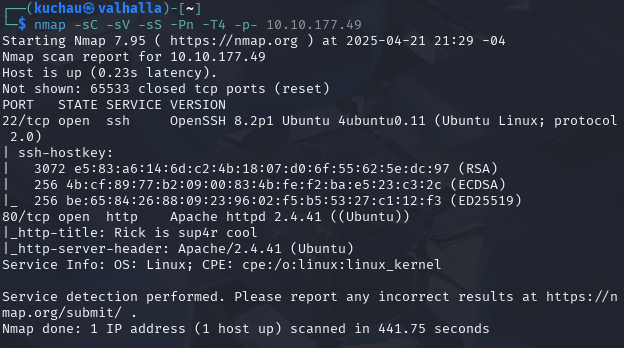

como podemos observar, encontramos dos puertos abiertos.

| Puerto | Servicio | Versión |
|--------|----------|---------|
| 22     |  SSH     | OpenSSH 8.2p1 |
| 80     |  HTTP    | Apache httpd 2.4.41 |

procedemos a revisar el contenido de la página alojada en el puerto 80.


es una página con un mensaje dejado a Morty. Para continuar, realizaremos una revisión estática del código fuente de la página.

En la revisión logramos encontrar un comentario con un nombre de usuario.

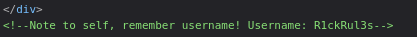

procedemos a realizar una enumeración de de directorios y archivos con **Gobuster**.

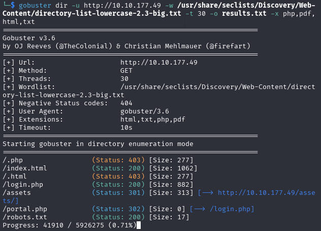

En el proceso, aparece un archivo llamado **robots.txt**, procedemos a ver lo que contiene.


Encontramos la iconica frase de Rick, procedemos a utilizar el usuario **R1ckRul3s** que habiamos encontrado en el código de la página y esta frase como contraseña en el login que obtuvimos de la enumeración de directorios.

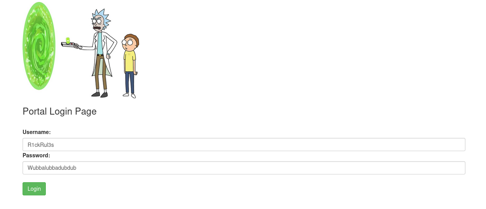

Al ingresar encontramos un input que tiene un placeholder que dice **Commands**

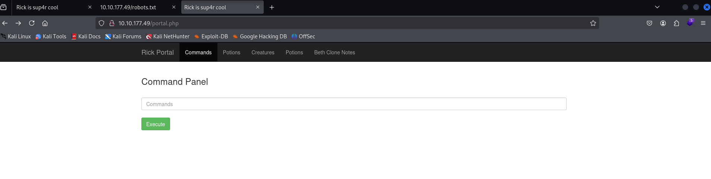

probamos el input ejecutando el siguiente comando

```bash
python3 --version
```

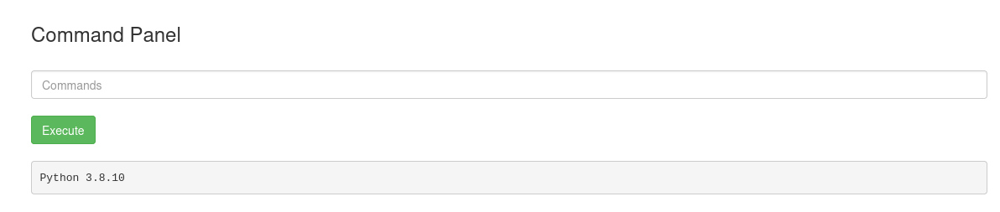

Con **Reverse Shell Generator** procedemos a obtener los comando para ejecutar una reverse shell.

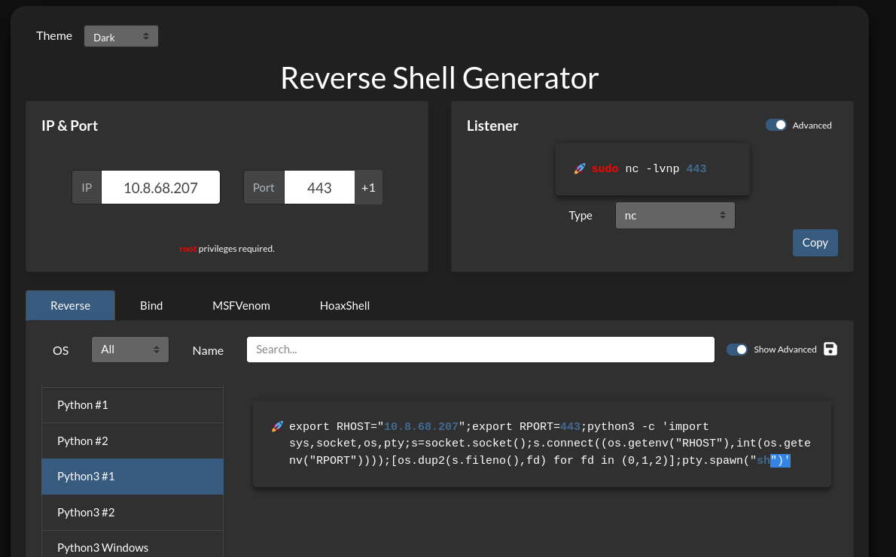

El comando que aparece más abajo lo ejecutamos en el input de la página y logramos obtener acceso al servidor como el usuario **www-data**

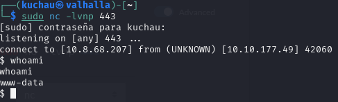

comenzamos a buscar el primer ingrediente que nos solicitan, en el mismo directorio podemos encontrar el archivo que lo contiene.


Buscamos el segundo ingrediente, para eso nos dirigimos a la ruta **/home/rick** y encontramos el archivo **'second ingredients'**

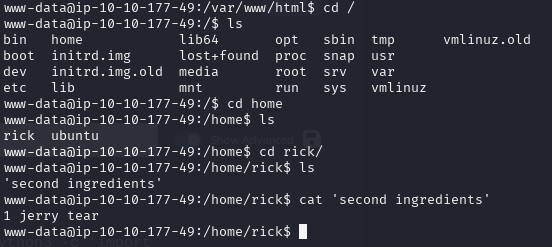

Para encontrar el último ingrediente, debemos realizar un escalado de privilegios, por lo que utilizamos el comando

```
sudo -l
```

Observamos que podemos utilizar cualquier comando como sudo sin necesidad de ingresar la contraseña, por lo que utilizaremos python3 para escalar privilegios.

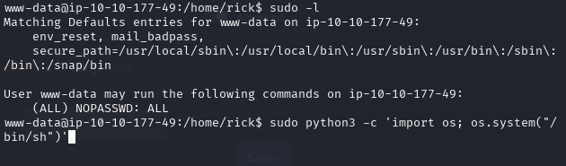

Comprobamos el usuario que utilizaremos

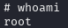

Ahora procedemos a dirigirnos a la ruta **/home/root** y encontramos un archivo llamado **3rd.txt** que contiene el último ingrediente.

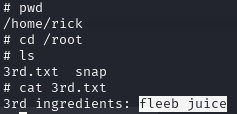

Con todos los ingredientes, podemos dar por finalizado el CTF

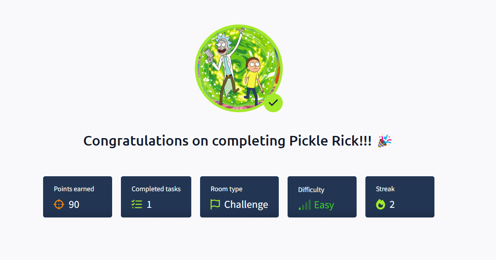

## 🛡️ Recomendaciones
Durante el proceso de explotación del sistema, se identificaron varias debilidades que podrían ser mitigadas con buenas prácticas de seguridad. A continuación se presentan recomendaciones para evitar que este tipo de compromisos vuelvan a ocurrir:

### 🔐 1. Fortalecer la autenticación

- **Eliminar credenciales estáticas del código fuente** o comentarios HTML accesibles públicamente.

- Implementar **mecanismos de autenticación robustos**, como 2FA.

- Evitar contraseñas triviales o frases predecibles como "R1ckRul3s", especialmente si se encuentran en archivos públicos.

### 🌐 2. Seguridad en el desarrollo web

- No dejar comentarios sensibles en el código fuente visible al cliente.

- Restringir el acceso a archivos como ``` robots.txt ``` si contiene información sensible o rutas ocultas.

- Validar y sanitizar correctamente cualquier entrada de usuario para evitar la ejecución de comandos (como el input vulnerable del panel).

- Deshabilitar funciones de ejecución remota si no son estrictamente necesarias.

### 🔍 3. Endurecimiento del servidor web (Apache)

- Mantener Apache actualizado para evitar vulnerabilidades conocidas.

- Aplicar políticas de acceso mediante ``` .htaccess ``` o configuraciones del servidor.

- Deshabilitar la visualización de versiones en encabezados (``` ServerTokens Prod ``` y ``` ServerSignature Off ```).

- Restringir el acceso a rutas sensibles con autenticación o IP whitelisting.

### 🧑‍💻 4. Seguridad del sistema operativo

- Configurar ``` sudo ``` con privilegios mínimos (principio de menor privilegio). Nunca permitir ``` ALL ``` sin contraseña a usuarios no confiables.

- Revisar permisos de archivos sensibles como ``` /home/rick ``` y ``` /home/root ```.

- Monitorear conexiones salientes para detectar posibles reverse shells.

- Usar herramientas como ``` auditd ``` o ``` fail2ban ``` para detectar actividad sospechosa.

### 🔐 5. Gestión de usuarios
- Eliminar usuarios innecesarios del sistema.
- Establecer políticas de contraseñas fuertes.
- Monitorear logs de acceso para detectar comportamientos anómalos.