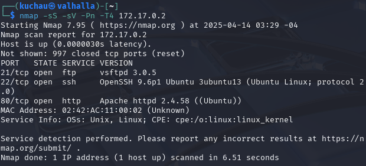
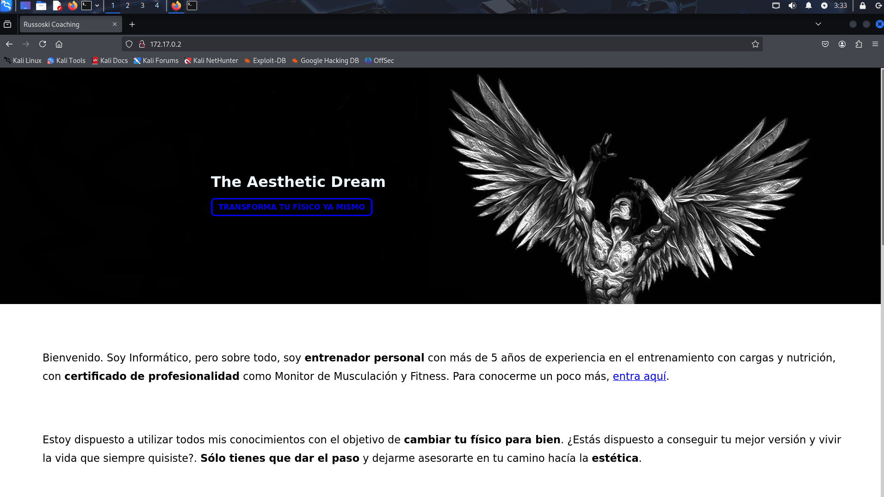
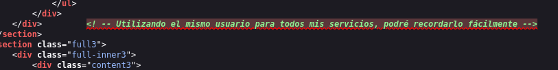
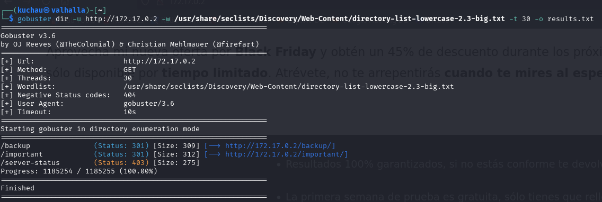
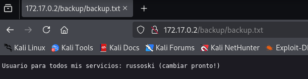
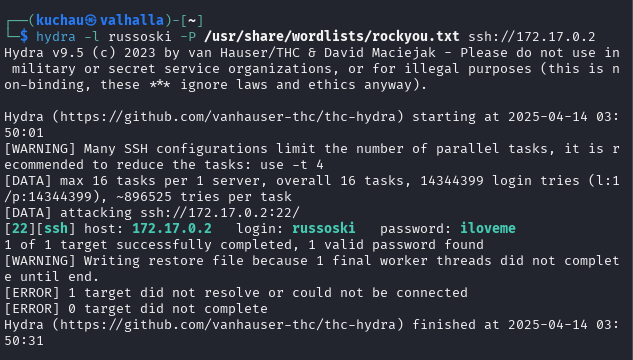
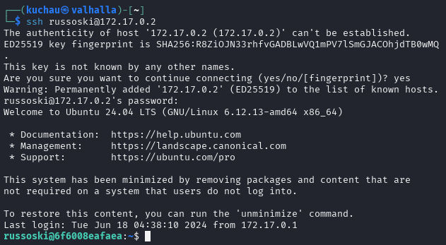
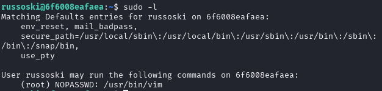
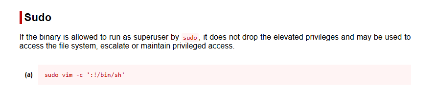
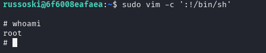

# 💻 DockerLabs - Obssesion

## Descripción
Máquina vulnerable a un ataque de fuerza bruta con hydra al protocolo SSH.

## 🔧 Herramientas utilizadas
- Nmap
- Gobuster
- Hydra

## 🧪 Técnicas aplicadas
- Enumeración de puertos y servicios
- Fuerza Bruta
- Escalada de privilegios con sudo

## 🧑‍💻 Desarrollo del laboratorio
Iniciamos con un escaneo de puertos y servicios con Nmap

detectamos 3 puertos abiertos con sus respectivos servicios

| Puerto | Servicio | Versión |
|--------|----------|---------|
|   21   | FTP      | vsftpd 3.0.5 |
| 22     | SSH      | OpenSSH 9.6p1 |
| 80     | HTTP     | Apache 2.4.58 |

procedemos a revisar la página alojada en el puerto 80.

parece ser una página normal. Al revisar el código fuente de la página, encontramos un comentario.

esto nos da un indicio, por lo que procedemos a enumerar otras rutas dentro de la página web con la herramienta Gobuster.

encontramos dos rutas interesantes **backup** y **important**, al revisar la ruta **http://{{ip_objetivo}}/backup**, encontramos el usuario que estabamos buscando.

con el usuario que encontramos, procedemos a intentar ingresar por SSH al servidor (recordar el mensaje que encontramos en el código de la página), esto lo realizaremos por fuerza bruta con la herramienta Hydra, el diccionario que utilizaremos será rockyou.txt

encontramos con exito la contraseña del usuario russoski.

| usuario | contraseña |
|---------|------------|
| russoski | iloveme   |

ingresamos por SSH al servidor.

al ingresar al servidor, comenzaremos con la escalación de privilegios, por lo que listamos los comandos que podemos ejecutar con sudo.

podemos ejecutar el comando vim con sudo, procedemos a buscar vim en **gtfobins**

encontramos el comando que ejecutaremos para acceder como root

y listo, tenemos acceso como root al sistema.

## 🛡️ Recomendaciones
- **Evitar comentarios sensibles en el código fuente HTML**: El mensaje encontrado en el código fuente dio pistas que facilitaron el ataque. Se recomienda evitar dejar comentarios con información útil para un atacante en producción.

- **Restringir o deshabilitar el acceso a directorios sensibles como `/backup`**: Estos directorios expuestos permitieron identificar al usuario del sistema. Se sugiere protegerlos mediante autenticación o eliminarlos si no son necesarios públicamente.

- **Usar contraseñas fuertes y no basadas en diccionarios comunes**: La contraseña del usuario fue descubierta mediante un ataque de diccionario con `rockyou.txt`. Se recomienda implementar una política de contraseñas robustas y forzar el uso de autenticación multifactor (MFA) para accesos SSH.

- **Limitar los comandos disponibles mediante `sudo`**: El usuario tenía permisos para ejecutar `vim` como root sin autenticación, lo que facilitó la escalada de privilegios. Se sugiere aplicar el principio de menor privilegio y auditar regularmente el archivo `sudoers`.

- **Monitorizar y alertar sobre intentos de fuerza bruta**: No hubo ningún mecanismo que limitara los intentos de login SSH. Es recomendable implementar herramientas como Fail2Ban o configurar SSH para bloquear IPs tras varios intentos fallidos.